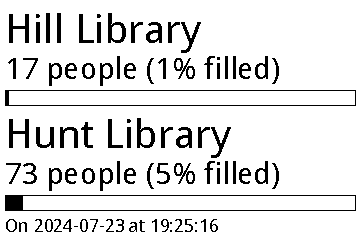

# Raspberry Pi E-Ink Dashboard

## Software

This set of python scripts is intended to facilitate displaying custom content on a waveshare e-paper/e-ink display (see more about the hardware below). Different custom content generator are defined as separate files in the `modules/` directory, with each containing an entry point function that takes the path to some config file as input and outputs a [pillow](https://python-pillow.org/) image.

For example, `modules/weather.py` will generate an image that displays local weather data.

Then, to show a module's image on the display, use `main.py`, passing the name of the module and the path to the config file as CLI arguments.

For example, `python main.py weather weather.json` will run the weather module with the config found in `weather.json` (see an example of a config file in `assets/`).

### Built-in modules

- `weather` - shows weather information for a certain location, specified by latitude and longitude
- `busyness` - displays data about how busy the libraries at NCSU are

### Adding custom modules

This system can be easily extended with additional custom modules by following these steps:

- write a python script with a function that takes a single string argument, the path to a config file, and outputs a pillow image
- in `main.py`, import your module and add an entry for your module in the `module_entrypoints` dictionary, with the key being a unique name for your module, and its corresponding value being the imported entrypoint function
- run `python main.py <module_name> <config_file.json>` to run your module and send its result to the display

### Example displays:

## Hardware

Uses the [Waveshare 3.52 inch e-Paper HAT](https://www.waveshare.com/3.52inch-e-paper-hat.htm):

Some of the code (low-level interactions with the display, found in the `display/` directory) in this project is taken from the drivers and examples at [this](https://github.com/waveshareteam/e-Paper) github repo. Further documentation for interacting with this display programmatically can be found at the wiki [here](https://www.waveshare.com/wiki/3.52inch_e-Paper_HAT_Manual#Python).
